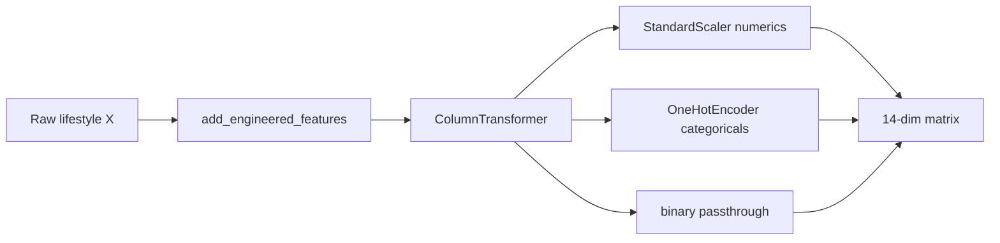

# Phase 3 - Preprocessing and feature engineering rationale

Phase 3 builds a leakage-safe feature matrix and persists the split. Implementation: [`src/features.py`](../../src/features.py), [`src/preprocessing.py`](../../src/preprocessing.py), notebook Part 3.

## Goal

Transform raw lifestyle columns into a numeric matrix suitable for logistic regression and random forest, while ensuring **test rows never influence** scaler or encoder fits.

## Pipeline shape



Steps in code: `engineer` → `preprocess` (`ColumnTransformer` with `remainder="drop"`).

## Train/test split

| Setting | Value | Why |
| ------- | ----- | --- |
| Method | `train_test_split(..., stratify=y)` | Preserve Healthy / Moderate / At Risk shares |
| Test size | 0.2 | Standard holdout; 240 test rows |
| Seed | 42 | Reproducible indices across Colab and local |
| Train / test counts | 960 / 240 | Fixed by size × stratification |

With `SEED=42`, class counts are:

| Class | Train | Test |
| ----- | ----- | ---- |
| Moderate | 594 | 149 |
| Healthy | 245 | 61 |
| At Risk | 121 | 30 |

**Why stratified, not random:** At Risk is only 12.6% of the data. An unlucky random split could leave too few At Risk rows in test for recall to mean anything. Even with stratification, n=30 At Risk in test remains small; report that limitation.

**What we rejected:** nested CV for the final number (heavier for Colab); a pure validation split without a final holdout (weaker for a single reported test table).

## Feature engineering (one binary)

Formula (fixed threshold, not learned from labels):

```text
high_screen_before_bed = 1 if screen_time_before_sleep > 2.0 else 0
```

Constants: `SCREEN_BEFORE_BED_THRESHOLD = 2.0`, name `high_screen_before_bed` in `src/features.py`.

**Why this feature:**

- Domain motivation: late-night screen use is a common sleep-hygiene concern and is already present as a continuous column.
- A binary flag gives logistic regression a simple contrast and gives trees an easy split candidate.
- The threshold is a **design decision**, not a hyperparameter search on labels. Searching thresholds against `y` on the full data would leak target information.

**Why only one engineered feature:** DS1 rewards a clear engineering story. Multiple ad hoc features without theory would look like score chasing.

**Rejected alternatives:** binning social-media hours into many levels (overlaps Baseline 2 and risks label-driven cut search); polynomial expansions (harder to justify for this table size).

## Encoding and scaling

| Block | Columns | Transform | Why |
| ----- | ------- | --------- | --- |
| Numeric | `age`, `daily_social_media_hours`, `sleep_hours`, `screen_time_before_sleep`, `academic_performance`, `physical_activity` | `StandardScaler` | Put logistic regression on a comparable scale; L2-style regularization via `C` assumes similar magnitudes |
| Categorical | `gender`, `platform_usage`, `social_interaction_level` | `OneHotEncoder(drop="first", handle_unknown="error", sparse_output=False)` | Nominal categories without ordinal misuse; drop first level to reduce collinearity |
| Binary | `high_screen_before_bed` | passthrough | Already in {0,1}; scaling unnecessary |

Category levels in the locked CSV:

- `gender`: female, male → 1 dummy after drop-first
- `platform_usage`: All Platforms, Facebook, Instagram, TikTok, YouTube → 4 dummies
- `social_interaction_level`: high, low, medium → 2 dummies

Processed width: 6 + 1 + 4 + 2 + 1 = **14**, enforced by `EXPECTED_PROCESSED_N_FEATURES` in `src/preprocessing.py`.

**Why `handle_unknown="error"`:** the schema is a fixed Kaggle snapshot. Silent unknown categories would hide data version bugs. Prefer fail-fast.

**Why one-hot for `social_interaction_level` instead of ordinal codes:** "low / medium / high" looks ordered, but we did not validate equal spacing. One-hot avoids inventing a numeric scale. Tradeoff: more columns; acceptable at this width.

## Fit policy (leakage control)

```text
pipe.fit_transform(X_train)
pipe.transform(X_test)
```

Never `.fit` on the full dataset or on test. Phase 4 later wraps the same preprocess steps inside a full `Pipeline` so GridSearchCV refits preprocessing **inside each training fold**, which is the correct nested behavior for CV.

## Artifacts

| File | Contents |
| ---- | -------- |
| `outputs/models/preprocess_pipeline.joblib` | Fitted engineer + ColumnTransformer |
| `outputs/models/train_test_split.joblib` | Indices, raw and processed matrices, `y`, feature names, split meta |

`make_xy(df)` builds `X` from `LIFESTYLE_FEATURES` only and asserts excluded columns are absent.

## Strengths

- Explicit lifestyle-only `X` construction.
- Stratification verified against expected counts in the notebook smoke cell.
- Engineered feature documented with a formula in notebook markdown.
- Processed feature count sanity-checked.

## Residual risks

- Fixed 2.0 hour threshold is arbitrary; sensitivity analysis was not run.
- One-hot with `drop="first"` makes coefficient interpretation relative to an implicit reference category; report authors should name those references if discussing logistic weights.
- Preprocessing alone does not remove synthetic-label risk; it only prepares features honestly.
